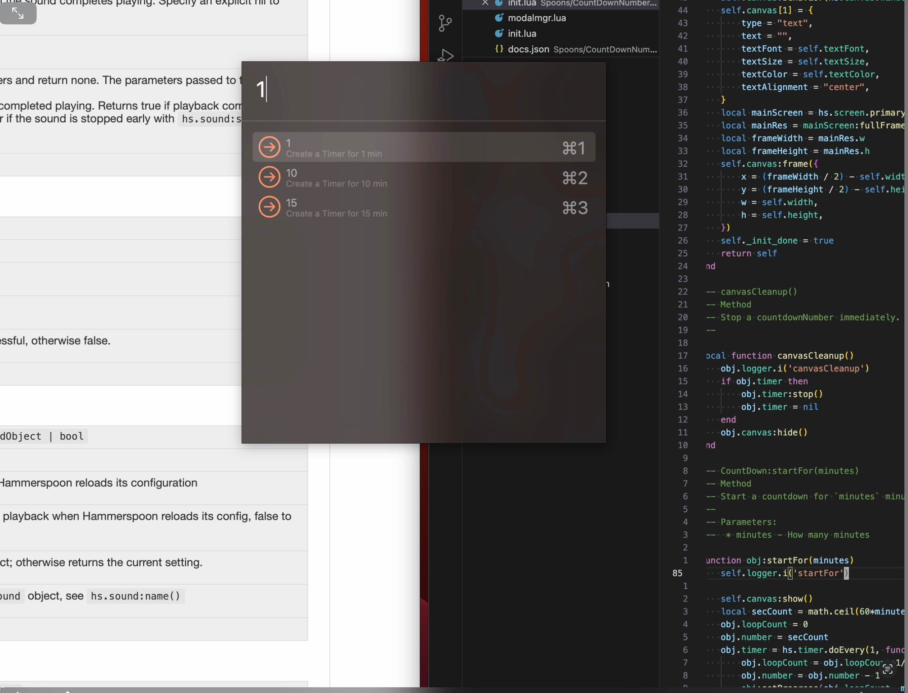
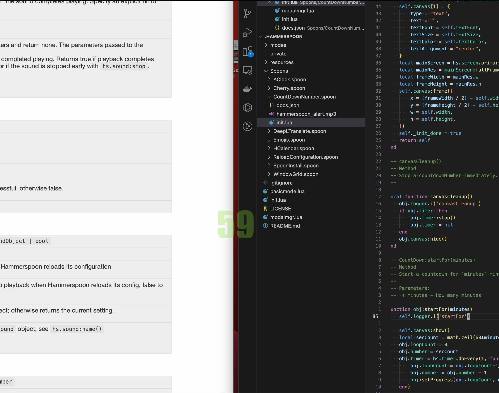

# Modified or borrowed from Awesome-hammerspoon. It is very personal and may not suit your needs. 
# Hammerspoon Modal Manager
A modal-based window management tool built on Hammerspoon, inspired by Vim's modal system.

## Intro 
```
My collection of lua scripts for [Hammerspoon](http://www.hammerspoon.org/). It has highly modal-based, vim-styled key bindings, provides some functionality like desktop widgets, window management, application launcher, dictionary translation, cheatsheets... etc.
Add private dir for personal use Model hotkeys mapping and AppLaunchers. 
```

## Core Concepts

### Modal System
- Similar to Vim's modal system
- Each modal represents a specific set of functionalities (window management, app switching, etc.)
- Users can switch between different modes via hotkeys

### Modal Manager
```lua
modalmgr = hs.hotkey.modal.new(modalmgr_keys[1], modalmgr_keys[2], 'Toggle Modal Supervisor')
```
- Acts as the top-level controller
- Manages entry/exit of all other modals
- Default activation: `Alt + Space`

### Feature Modules
```
modes/
├── appM.lua -- Application management
├── clipboardM.lua -- Clipboard management
├── resizeM.lua -- Window resizing
├── viewM.lua -- View management
└── windowspace.lua -- Move Window to Space management
```

## Code Flow

### Initialization Flow
1. `init.lua` loads all modules
2. Initializes modal manager
3. Registers hotkeys for each module
4. Starts default modal

### Modal Switching Flow
1. User presses `Alt + M` to enter modal manager, default key can be changed based on the private/awesomeconfig.lua
2. From modal manager, can choose:
   - `Alt + A` → Application Mode
   - `Alt + R` → Resize Mode
   - `Alt + V` → View Mode
   - `Escape` → Exit Modal
### UI Feedback System
- `modal_stat()` - Shows current modal status
- `modal_bg` - Background display
- `modal_show` - Status display
- `hotkeytext` - Hotkey hints

### Configuration System
- All hotkeys are customizable
- Hotkey configurations stored in variables with `_keys` suffix
- Examples: `modalmgr_keys`, `appM_keys`, `resizeM_keys`

### Usage Example
1. Start Hammerspoon
2. Press `Alt + M` to enter modal manager
3. Choose from:
   - `Alt + A` → Application switching mode
   - `Alt + R` → Window resize mode
   - `Alt + V` → View management mode
   - And more...
4. Use corresponding hotkeys in each mode
5. Press `Escape` or `Q` to exit current mode

## Architecture Benefits

The framework is highly modular, with each functionality encapsulated in independent modals and managed uniformly through the modal manager. This design makes feature extension and maintenance relatively easy.

## Contributing

Feel free to submit issues and enhancement requests!

### Key Functions

## Plugins and Widgets
```
caffeinator  -- Prevent computer fall asleep, controlled by bar icon.
AppLauncher -- custom launcher
AClock -- custom transparent green Digital Clock show on top left of every space.
SpaceNumber -- custom transparent green Space Number show on top right of every space.
Cheatsheet -- showavailableHotkey (you don't need to remember lots of keybindings, just call cheatsheet.)
CountDownNumber -- custom plugin to display countdown number, complete with an alert sound, with a chooser
Window Resize -- using keys to control window size
SpoonInstall -- thirdparty Plugin manager
WindowGrid -- thirdparty window manager plugin
Emojis -- thirdparty Emoji plugin 
DeepLTranslate -- thirdparty translate plugin
Cherry -- thirdparty pomodoro plugin, just change some picture/time
Reload Plugins-- thirdparty reload plugin
Custom commands -- send 'exit' hotkey; hide desktop hotkey; show desktop hotkey
Clipboard -- show clipboard content
Mouse control key -- move mouse through keyboard
windowspace -- move window to lefe/right space integrated from https://github.com/Hammerspoon/hammerspoon/issues/3636#issuecomment-2384239506
```

## Get started

1. Install [Hammerspoon](http://www.hammerspoon.org/) first.
2. Clone my configuration `git clone https://github.com/zzuse/hammerspoon.git ~/.hammerspoon`
3. Reload the configutation.

and you're set.

## Keep update
`cd ~/.hammerspoon && git pull`

## Details 
#### 1. Main entry point `init.lua`.
`init.lua` ==> private config (`awesomeconfig.lua`) ==> modalmgr(call `basicmode.lua`) ==> loadSpoon plugins  
#### 2. The modalmgr controls entering appMode, clipboardMode, cheatsheetMode, resizeMode, viewMode, a sign on the bottom right will show mode.

| Key bindings                | Movement                   |
|-----------------------------|----------------------------|
| <kbd>⌥</kbd> + <kbd>M</kbd> | Mode on/off                |
| <kbd>⌥</kbd> + <kbd>A</kbd> | Enter `app` mode           |
| <kbd>⌥</kbd> + <kbd>C</kbd> | Enter `clipboard` mode     |
| <kbd>⌥</kbd> + <kbd>R</kbd> | Enter `resize` mode        |
| <kbd>⌥</kbd> + <kbd>S</kbd> | Enter `cheatsheet` mode    |
| <kbd>⌥</kbd> + <kbd>T</kbd> | Count down number          |
| <kbd>⌥</kbd> + <kbd>P</kbd> | Count down number pause    |
| <kbd>⌥</kbd> + <kbd>V</kbd> | Enter `view` mode          |
| <kbd>⌥</kbd> + <kbd>I</kbd> | Windows Hint               |
| <kbd>⌥</kbd> + <kbd>Z</kbd> | Toggle Hammerspoon console |
| <kbd>⌥</kbd> + <kbd>G</kbd> | Plugin Window grid         |
| <kbd>⌥</kbd> + <kbd>E</kbd> | Plugin Emojis              |
| <kbd>⇧ ^</kbd> + <kbd>E</kbd>  | send EXIT to terminal   |
| <kbd>⇧ ^</kbd> + <kbd>H</kbd>  | hide desktop file       |
| <kbd>⌘ ⇧ ^</kbd> + <kbd>H</kbd> | show desktop file      |
| <kbd>^ ⌥ ⌘</kbd> + <kbd>C</kbd> | spoon.ReloadConfigure  |
| <kbd>^ ⌥ ⌘</kbd> + <kbd>D</kbd> | DeepL Translate        |
| <kbd>^ ⌥ ⌘</kbd> + <kbd>S</kbd> | pomodoro timer tart    |
| <kbd>^ ⌥ ⌘</kbd> + <kbd>P</kbd> | pomodoro timer pause   |
| <kbd>^ ⌥ ⌘</kbd> + <kbd>R</kbd> | pomodoro timer resume  |
| <kbd>^ ⌥ ⌘</kbd> + <kbd>T</kbd> | toggle current time    |

#### 3. App Mode, it is straightforward, just launch APPs.
#### 4. If you enter viewMODE(ALT+V), you can using your H/I/J/K to scroll your mouse.

| Key bindings                | Movement                   |
|-----------------------------|----------------------------|
| <kbd>H</kbd>                  | Scroll Leftward               |
| <kbd>L</kbd>                  | Scroll Rightward              |
| <kbd>J</kbd>                  | Scroll Downward               |
| <kbd>K</kbd>                  | Scroll Upward                 |
| <kbd>^</kbd> + <kbd>H</kbd>   | Move Mouse Leftward by 50px   |
| <kbd>^</kbd> + <kbd>L</kbd>   | Move Mouse Rightward by 50px  |
| <kbd>^</kbd> + <kbd>J</kbd>   | Move Mouse Downward by 50px   |
| <kbd>^</kbd> + <kbd>K</kbd>   | Move Mouse Upward by 50px     |
| <kbd>⇧</kbd> + <kbd>H</kbd>   | Move Mouse Leftward by 10px   |
| <kbd>⇧</kbd> + <kbd>L</kbd>   | Move Mouse Rightward by 10px  |
| <kbd>⇧</kbd> + <kbd>K</kbd>   | Move Mouse Upward by 10px     |
| <kbd>⇧</kbd> + <kbd>J</kbd>   | Move Mouse Downward by 10px   |
| <kbd>^ ⇧</kbd> + <kbd>H</kbd> | Move Mouse Leftward by 1px    |
| <kbd>^ ⇧</kbd> + <kbd>L</kbd> | Move Mouse Rightward by 1px   |
| <kbd>^ ⇧</kbd> + <kbd>K</kbd> | Move Mouse Upward by 1px      |
| <kbd>^ ⇧</kbd> + <kbd>J</kbd> | Move Mouse Downward by 1px    |
| <kbd>,</kbd>                  | Left Mouse Click              |
| <kbd>.</kbd>                  | Right Mouse Click             |
| <kbd>Q</kbd>                  | EXIT                          |

#### 5. If you enter resizeMODE, you can using your Y/O/I/M/... to stretch your window.

| Key bindings                | Movement                   |
|-----------------------------|----------------------------|
| <kbd>⇧</kbd> + <kbd>Y</kbd> |'Shrink Leftward'           |
| <kbd>⇧</kbd> + <kbd>O</kbd> |'Stretch Rightward'         |
| <kbd>⇧</kbd> + <kbd>M</kbd> |'Stretch Downward'          |
| <kbd>⇧</kbd> + <kbd>I</kbd> |'Shrink Upward'             |
| <kbd>F</kbd>                |'Fullscreen'                |
| <kbd>C</kbd>                |'Center Window'             |
| <kbd>⇧</kbd> + <kbd>C</kbd> |'Resize & Center'           |
| <kbd>H</kbd>                |'Lefthalf of Screen'        |
| <kbd>J</kbd>                |'Downhalf of Screen'        |
| <kbd>K</kbd>                |'Uphalf of Screen'          |
| <kbd>L</kbd>                |'Righthalf of Screen'       |
| <kbd>Y</kbd>                |'NorthWest Corner'          |
| <kbd>N</kbd>                |'SouthWest Corner'          |
| <kbd>M</kbd>                |'SouthEast Corner',         |
| <kbd>O</kbd>                |'NorthEast Corner',         |
| <kbd>=</kbd>                |'Stretch Outward',          |
| <kbd>-</kbd>                |'Shrink Inward',            |
| <kbd>⇧</kbd> + <kbd>H</kbd> |'Move Leftward',            |
| <kbd>⇧</kbd> + <kbd>L</kbd> |'Move Rightward',           |
| <kbd>⇧</kbd> + <kbd>J</kbd> |'Move Downward',            |
| <kbd>⇧</kbd> + <kbd>K</kbd> |'Move Upward',              |
| <kbd>[</kbd>                |'Focus Westward',           |
| <kbd>]</kbd>                |'Focus Eastward',           |
| <kbd>up</kbd>               |'Move to monitor above'     |
| <kbd>down</kbd>             |'Move to monitor below'     |
| <kbd>right</kbd>            |'Move to monitor right'     |
| <kbd>left</kbd>             |'Move to monitor left',     |
| <kbd>space</kbd>            |'Move to next monitor'      |
| <kbd>Q</kbd>                | EXIT                       |

#### 6. Custom Countdown Number Plugin

##### 1. A countdown number from chooser dialog

##### 2. Result can be obtained from input box if no valid option

##### 3. Start a countdown

##### 4. At last there will be a completion sound alert.

--------------------------


#### 7. Desktop Widgets

<details>
<summary>More details</summary>

**UPDATE:** Add new widget `hcalendar` and make it default module. The design borrowed from [here](https://github.com/ashikahmad/horizontal-calendar-widget).


</details>

#### 8. Move window to Left/Right Spaces
| Key bindings                | Movement                   |
|-----------------------------|----------------------------|
| <kbd>⇧⌥ </kbd> + <kbd>1</kbd> | move window to one left space|
| <kbd>⇧⌥ </kbd> + <kbd>3</kbd> | move window to one right space|

...


## Thanks to

<details>
<summary>More details</summary>

[http://www.hammerspoon.org/](http://www.hammerspoon.org/)

[https://github.com/zzamboni/oh-my-hammerspoon](https://github.com/zzamboni/oh-my-hammerspoon)

[https://github.com/scottcs/dot_hammerspoon](https://github.com/scottcs/dot_hammerspoon)

[https://github.com/dharmapoudel/hammerspoon-config](https://github.com/dharmapoudel/hammerspoon-config)

[http://tracesof.net/uebersicht/](http://tracesof.net/uebersicht/)

[sample-configurations](https://github.com/Hammerspoon/hammerspoon/wiki/Sample-Configurations)

[github move spaces Issues](https://github.com/Hammerspoon/hammerspoon/issues/3636#issuecomment-2384239506)
</details>

## Welcome to

Share your scripts and thoughts.

: )
